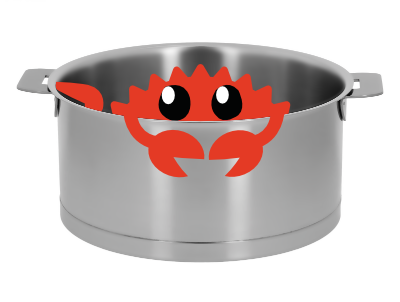

# saucepan

Utilities for dealing with source spans.

Saucepan is a mash-up of [codespan](https://crates.io/crates/codespan) and 
[nom_locate](https://crates.io/crates/nom_locate). The [nom](https://crates.io/crates/nom) dependency is *optional* and can be
disabled. Unlike nom_locate, saucepan does not have no-std support. It does include
implementations of `File` and `Files` (as `Source` and `Sources` resp.), which are compatible
with [codespan-reporting](https://crates.io/crates/codespan-reporting).

This crate is part of a much larger collection of generic scanning and parsing tools in development
and is still a bit of a work in progress.

# authors

As two different projects were used to make a third, authorship needs clarification. The authors
 are as follows.

| saucepan mash-up     | Robert Jacobson         |
| :------------------- | :---------------------- |
|                      |                         |
| codespan             | Brendan Zabarauskas     |
|                      |                         |
| nom_locate           | Florent FAYOLLE         |
|                      | Christopher Durham      |
|                      | Valentin Lorentz        |

